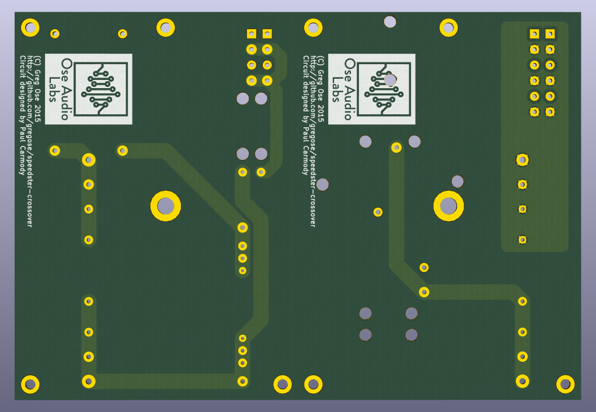

# Ose Audio Labs' Speedster Crossover

Crossover PCB for [Paul Carmody's Speedster speakers](https://sites.google.com/site/undefinition/speedster). Designed with V-cut stackable boards for high and low-pass circuits.

### Render

### Schematic

### BOM

Layout was designed for the following components. Extra pads have been added to allow the use of physically smaller capacitors.

Ref | Component | Link 
----| --------- | -------------
R1  | Vishay Mills MRA-12 10R | http://www.digikey.com/product-search/en?mpart=MRA-1210R00FE12&vendor=541
R2  | Vishay Mills MRA-12 8R | http://www.digikey.com/product-search/en?mpart=MRA-128R000FE12&vendor=541
C1  | AUDYN CAP PLUS MKP 2.20 MF/ 800 V 2% AXIAL 43X25 | https://www.intertechnik.com/Shop/Cross-over-parts/Capacitors/Audyn-Cap-Plus/_PLUS22008_1768,en,280,46735
C2  | AUDYN CAP PLUS MKP 4.70 MF/ 800 V 2% AXIAL 63X35 | https://www.intertechnik.com/Shop/Cross-over-parts/Capacitors/Audyn-Cap-Plus/_PLUS47008_1768,en,280,46738
C3  | AUDYN CAP PLUS MKP 4.70 MF/ 800 V 2% AXIAL 63X35 | https://www.intertechnik.com/Shop/Cross-over-parts/Capacitors/Audyn-Cap-Plus/_PLUS47008_1768,en,280,46738
L1  | Meniscus Audio .25mH, Perfect Layer 20ga. | http://meniscusaudio.com/025mh-20ga-p-597.html
L2  | Meniscus Audio 1.5mH, Layer  Wound 18ga. | http://meniscusaudio.com/150mh-18-ga-p-638.html
L3  | Meniscus Audio .35mH, Layer  Wound 18ga. | http://meniscusaudio.com/035mh-18-ga-p-622.html
X1  | Phoenix Contact 1730418 (CONN TERM BLOCK 4POS 5.08MM) | http://www.digikey.com/scripts/DkSearch/dksus.dll?Detail&itemSeq=185999766 
X2  | Phoenix Contact 1730434 (CONN TERM BLOCK 6POS 5.08MM) | http://www.digikey.com/scripts/DkSearch/dksus.dll?Detail&itemSeq=185965446
